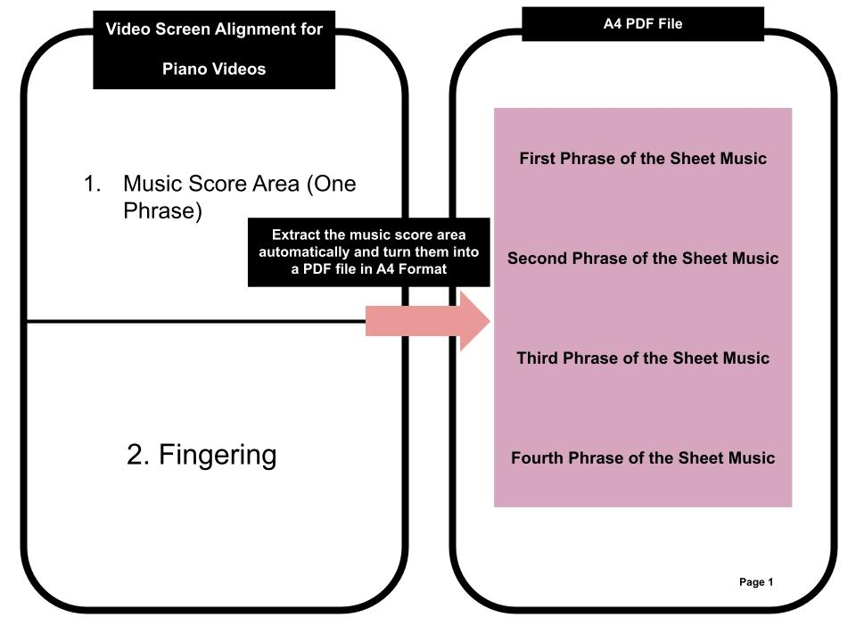

# Piano Sheet Generator

## [Notice]: This project is for personal use only due to copyright restrictions.

## Project Overview


This project provides a Python-based tool for extracting musical score regions from a video, processing them, and exporting them as a single PDF document. The tool is tailored for scenarios where musical scores appear in video recordings, such as piano tutorials or sheet music display videos.

## **Activate the Project**

Follow these steps to set up and activate the project environment:

### **1. Create a Python Virtual Environment** (if not already created)
Run the following command to create a virtual environment named `dev`:
```bash
python -m venv dev
```

### **2. Activate the Virtual Environment**
- **Windows**:
  ```bash
  dev\Scripts\activate
  ```

- **macOS/Linux**:
  ```bash
  source dev/bin/activate
  ```

### **3. Install Required Libraries**
Install all necessary dependencies listed in the `requirements.txt` file:
```bash
pip install -r requirements.txt
```

### **4. Deactivate the Virtual Environment**
When you're done, deactivate the virtual environment with:
```bash
deactivate
```

## Features
1. **Score Detection and Capture**: Extracts score regions from videos based on Region of Interest (ROI) and visual boundaries.
2. **Customizable ROI and Parameters**: Supports setting custom ROI, frame gaps, and other parameters for precise control.
3. **PDF Export**: Combines the captured score images into a single, organized PDF file for easy distribution.

## Prerequisites
The following Python libraries are required:
- OpenCV (`cv2`)
- NumPy
- FPDF
- PIL (Pillow)

Install dependencies using pip:
```bash
pip install opencv-python numpy fpdf pillow
```

## How It Works
1. **Video Processing**:
   - Load a video file.
   - Define the Region of Interest (ROI) for score detection.
   - Process frames within a specified time range.
   - Detect score boundaries and capture relevant images.
   - Skip repetitive frames based on threshold settings.

2. **Score Image Saving**:
   - Extracted regions are saved as PNG images in a specified directory.

3. **PDF Generation**:
   - Combine the saved images into a single PDF file.

## Usage

### 1. Configure Parameters
Edit the `main` function to specify the video path, ROI, and other parameters:
```python
video_path = "videos/piano2.mp4"
roi = (0, 0, 1700, 168)  # Define the Region of Interest
threshold = 50
min_frames_gap = 20
start_time = 5  # Start time in seconds
end_time = 2148  # End time in seconds
skip_blank = True # The function is disabled
blank_threshold = 10 # The function is disabled
output_dir = "captures"  # Directory to save extracted images
```

### 2. Run the Script
Execute the script to process the video and generate the PDF:
```bash
python main.py
```

### 3. Output
- Extracted score images will be saved in the `captures` directory.
- A PDF file named `multi_score_output.pdf` will be created in the current working directory.
